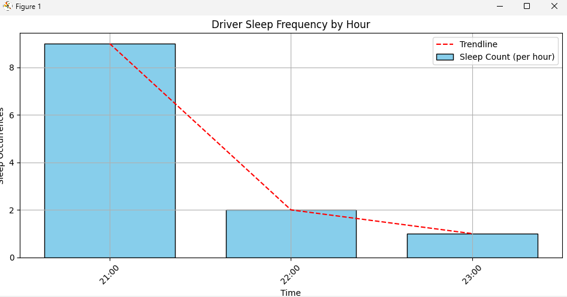
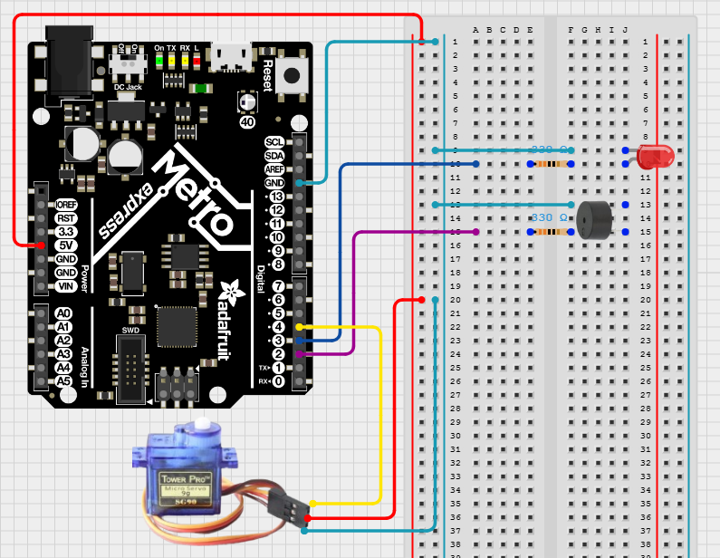
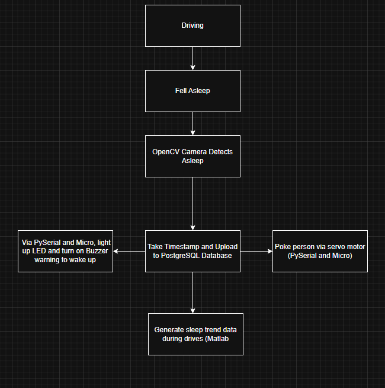
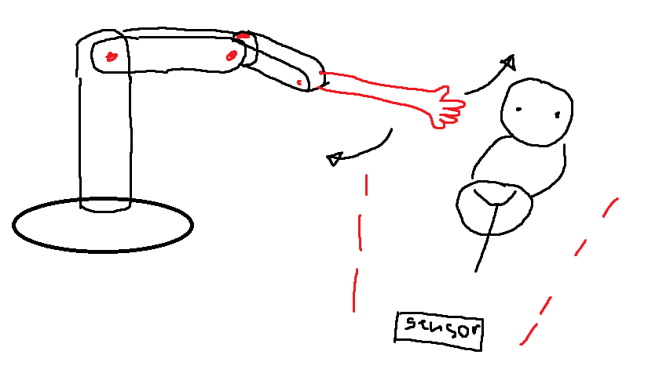
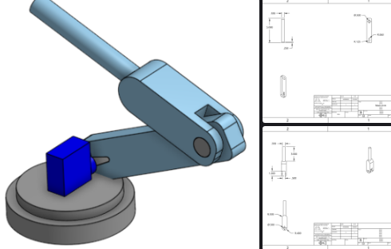
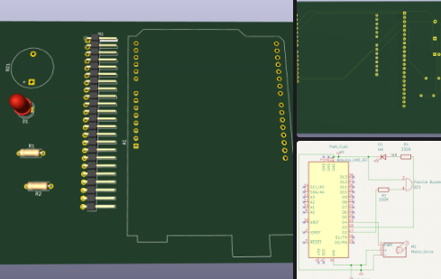

# DriveGuard

A prototype real-time drowsiness detection system that monitors driver alertness using facial landmark detection and provides immediate hardware-based alerts to prevent accidents.

## Overview

DriveGuard uses computer vision to detect when a driver is falling asleep by monitoring eye aspect ratio (EAR) and triggers physical alerts through an Adafruit microcontroller system including LEDs, buzzer, and servo motor. All sleep incidents are logged to a PostgreSQL database for trend analysis. This project was made for the **UCSD ECE SIPP 2025 Final Project**.

## Features

- **Real-time Face Detection**: Uses MediaPipe for accurate facial landmark detection
- **Eye Aspect Ratio Monitoring**: Calculates EAR to determine eye closure
- **Hardware Alerts**: LED, buzzer, and servo motor activation when drowsiness detected
- **Database Logging**: PostgreSQL integration for sleep incident tracking
- **Trend Analysis**: Visualization of sleep patterns and most common sleep hours
- **Configurable Thresholds**: Adjustable sensitivity and timing parameters

## Database Features

- **Automatic Logging**: Timestamps of all sleep incidents
- **Trend Analysis**: Most common sleep hours
- **Visual Reports**: Bar charts with trendlines showing sleep patterns throughout a day
- **Data Persistence**: All incidents stored for long-term analysis

### Example Reports




## How It Works

1. **Video Capture**: Captures real-time video from webcam
2. **Face Detection**: Uses MediaPipe to detect facial landmarks
3. **EAR Calculation**: Computes Eye Aspect Ratio for both eyes
4. **Sleep Detection**: Monitors EAR below threshold for consecutive frames
5. **Alert System**: Triggers hardware alerts via serial communication
6. **Data Logging**: Records sleep incidents with timestamps
7. **Analysis**: Generates sleep pattern visualizations

### Eye Aspect Ratio Formula
```
EAR = (||p2-p6|| + ||p3-p5||) / (2||p1-p4||)
```
Where p1-p6 are specific landmark points around the eye.

## Disclaimers

This project is only a prototype build and not at all a finished product. There are a few limitations:
- Database is only local to your computer
- Python 3.10 as a current version for MediaPipe can be a limiting factor
- In its current iteration, it is not intended to actually be put in a car (needs part optimization, design, simplify without computer, etc)

## Required Hardware

- 1 x Adafruit Metro M0 Express (CircuitPython compatible microcontroller)
- 1 x Red LED
- 1 x Passive Buzzer 
- 1 x Servo Motor
- 1 x Breadboard
- 2 x 330ohm Resistors
- Wires
- 1 x Webcam
- 1 x Computer

## Installation

### Software Prerequisites

- Python 3.10 (As of 7/30/2025, MediaPipe is incompatible with certain Python Versions)
- PostgreSQL

### Python Dependencies

```bash
pip install opencv-python mediapipe numpy psycopg2 pandas matplotlib pyserial
```

### Required CircuitPython Libraries

- The following need to the in your `lib` folder on your CIRCUITPY drive:
    - `adafruit_motor`
    - `simpleio.mpy`
- You can install them using the [Adafruit CircuitPython Bundle](https://circuitpython.org/libraries)

### Hardware Setup

1. Setup CircuitPython to your Adafruit Metro
2. Copy `boot.py` and `code.py` to the microcontroller
3. Connect hardware components according to the schematic (see `/images` folder)
4. Connect microcontroller to computer via USB



### Database Setup

1. Install PostgreSQL
2. Create a database named "DriveGuard"
3. Update connection parameters in `sleep_database.py`:
   ```python
   self.connection = psycopg2.connect(
       host="localhost", 
       dbname="DriveGuard", 
       user="your_username", 
       password="your_password", 
       port=5432
   )
   ```

### Serial Port Configuration

Update the COM port in `micro_connection.py`:
```python
self.ser = serial.Serial('YOUR_COM_PORT', 115200, timeout=1)
```

## Usage

### Basic Usage

```bash
python driveguard.py
```

### Individual Component Testing

```bash
# Test sleep detection only
python sleep_detector.py

# View sleep trends (uncomment methods in driveguard.py)
python driveguard.py
```

### Configuration Parameters

- `ear_threshold`: Eye aspect ratio threshold (default: 0.24)
- `consec_frames`: Consecutive frames for sleep detection (default: 90 ≈ 3 seconds)
- `video_path`: Camera index (default: 0 for primary webcam)

## Controls

- **'p' key**: Stop video processing and exit
- **Window close**: Alternative way to stop the system
- **Hardware alerts**: Automatically triggered, last 5 seconds

## Customization

### Adjusting Sensitivity

- Lower `ear_threshold` for more sensitive detection
- Increase `consec_frames` for longer confirmation period
- Modify hardware alert duration in `micro_connection.py`

### Hardware Modifications

- Adjust servo sweep range and speed via `frequency` and `duty_cycle`
- Modify buzzer frequency and volume via `frequency` and `duty_cycle`

## Project Structure

```
DriveGuard/
├── driveguard.py              # Main application entry point
├── sleep_detector.py          # Core sleep detection logic
├── FaceMeshModule.py          # MediaPipe face mesh wrapper
├── sleep_database.py          # PostgreSQL database operations
├── micro_connection.py        # Serial communication with hardware
├── boot.py                    # CircuitPython boot configuration
├── code.py                    # Microcontroller main code
├── images/                    # Hardware schematics and diagrams
├── README.md                  # Project documentation
└── .gitignore                 # Git ignore rules
```

## Troubleshooting

### Common Issues

- **Camera not found**: Check `video_path` parameter
- **Serial connection failed**: Verify COM port and microcontroller connection
- **Database connection error**: Check PostgreSQL service and credentials
- **Import errors**: Ensure all Python dependencies are installed

### Hardware Issues

- **No hardware response**: Check serial port, microcontroller code, and wiring

## Future Enhancements

- Mobile app integration for remote monitoring
- Server-based databasing of PostgreSQL
- Multiple driver profiles and personalized thresholds
- Integration with vehicle systems
- Machine learning model improvements
- Real-time dashboard
- Other driving safety features

## Extras

This is the original brainstorm flow chart used when building the project



This is an imaginative demonstration of how the product would be used



This is an arm that would be attached to the servo motor to poke the driver for physical stimulus



This is a PCB design for the build



## Credits

- [Adafruit](https://www.adafruit.com/) for Metro M0 Express and CircuitPython
- [Pushtogithub23](https://github.com/Pushtogithub23) for the original OpenCV and MediaPipe code that we adapted from [Eye Blink Detection](https://github.com/Pushtogithub23/Eye-Blink-Detection-using-MediaPipe-and-OpenCV)
    - Huge thank you to [Girish Krishnan](https://www.linkedin.com/in/girk/) for linking this resource
- Developed by:
    - [Eliah De Guzman](https://www.linkedin.com/in/eliahdeguzman/) (Developer Member)
    - [Katherine Bui](https://www.linkedin.com/in/katherine-bui-a7ab51297) (Developer Member)
    - [Robin Adhikari](https://www.linkedin.com/in/robin-adhikari1/) (Developer Member)
    - [Mitch Zheng](https://www.linkedin.com/in/mitch-zheng-5643ab281/) (Developer Member)

## License

This project is open source and available under the [MIT License](LICENSE)

## Dear ECE SIPP Team

We wanted to thank you for gracing us with the opportunity to participate in this program. This month-long series of zoom meetings has provided us with countless resources and bits of knowledge that will follow us throughout our engineering lives. From technical sessions on CircuitPython to professional sessions with professors and alumni, you truly have provided a breadth of valuable resources.

Even more so, we made valuable connections along the way. We were able to have direct relations with Professor Karcher Morris, despite not even being enrolled in UCSD yet. That is such a memorable experience for us. Even the TAs (Nix, Terry, Afraz, and Marco) were extremely enjoyable to seek help and conversation with. Not to mention the fact that the four of us team members were able to meet. We went into the program somewhat alone, but have emerged with new engineering comrades. We even made plans to meet up when school begins.

This project is our thank you. In the sentiments of engineering as a whole, we opted to embrace new technologies in the same way you have encouraged us throughout the program.

From the four of us to you, a memento to remember.

Kindly,

Eliah De Guzman, Robin Adhikari, Mitch Zheng, and Katherine Bui